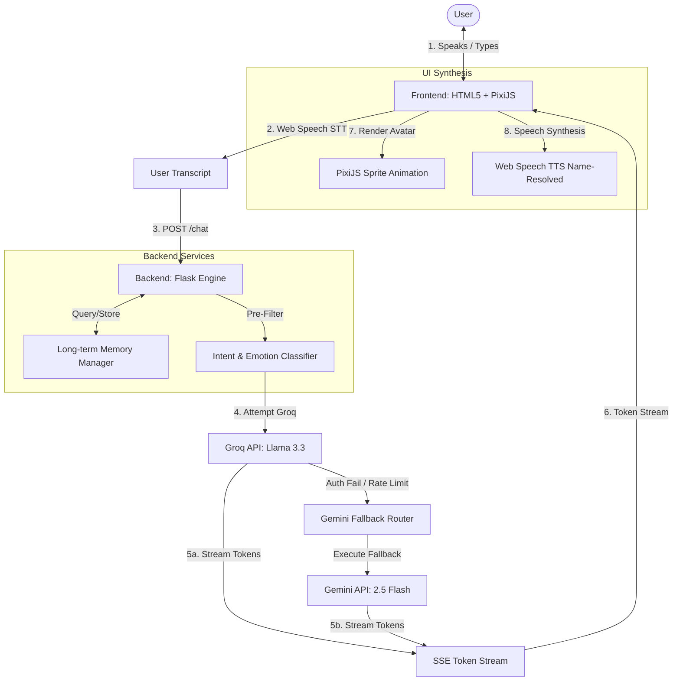

# 🌸 Maya - Premium Personal AI Companion

Maya is a state-of-the-art personal AI companion that combines advanced developer logic with a warm, natural, and expressive **"Real Girl" personality**. 

It is built on a **Dual-Engine Core** that uses Groq for high-speed primary generation and automatically falls back to Gemini 2.5 Flash in case of limit exhaustion, authentication issues, or server failures.

---

## 🎨 System Architecture



---

## ✨ Key Features

* 🗣️ **Devanagari Hinglish Speech**: Responds naturally in colloquial Hinglish (Devanagari script) with feminine verb endings.
* ⚡ **Dual-Engine Failover**: Bypasses Groq connection limits and auth failures instantly to switch to Gemini 2.5 Flash with zero-latency overhead.
* 🎭 **PixiJS Sprite Engine**: Real-time interactive avatar animations mapped to conversational emotions (happy, sad, neutral, drinking).
* 🔒 **Name-Locked TTS**: Locks the voice directly by name (`Microsoft Neerja` / Google Hindi) and resolves references dynamically on every speech event to prevent browser voice-shift bugs.
* 🛡️ **Clean Mode Filters**: Advanced regex strippers to automatically remove markdown formats and emojis to keep responses clean.
* 🔑 **Zero-Config Frontend**: Keys are resolved 100% server-side via `.env`, eliminating client-side API configuration prompts on load.

---

## 🚀 Quick Start

### 1. Prerequisites
Ensure you have Python 3.10+ installed on your system.

### 2. Install Dependencies
Clone the repository, navigate to the directory, and install the required Python packages:
```bash
pip install -r requirements.txt
```

### 3. Environment Setup
Create a `.env` file in the `maya_flask/` directory and configure your credentials:
```env
# Groq API Configuration
GROQ_API_KEY=your_groq_api_key_here
GROQ_MODEL=llama-3.3-70b-versatile

# Gemini Fallback Configuration
GEMINI_API_KEY=your_gemini_api_key_here

# Flask Configuration
FLASK_APP=app.py
FLASK_ENV=development
PORT=5000
```

### 4. Run the Dev Server
Launch the Flask development server:
```bash
python maya_flask/app.py
```
Open your browser and navigate to `http://127.0.0.1:5000` to start chatting with Maya! 🌸
